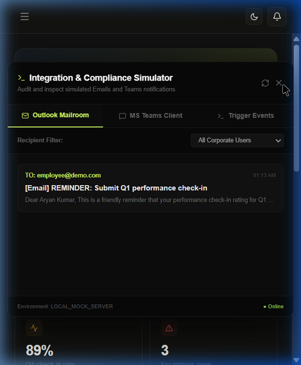
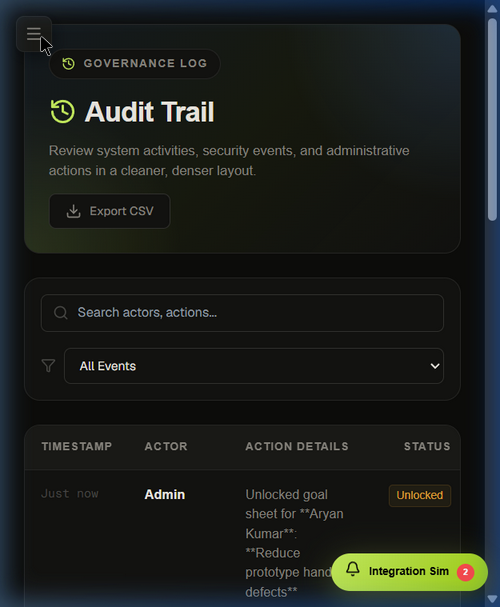
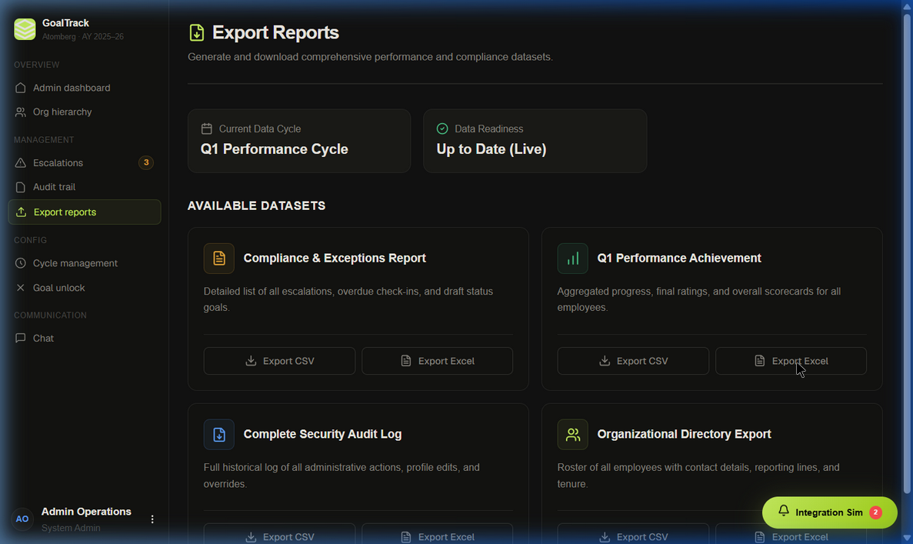

# Walkthrough - Responsive Portal & Export Fixes

We have successfully refined the AtomQuest portal layout to be completely mobile-responsive, resolved the layout bugs in the Integration & Compliance Simulator, and fixed the performance/audit export report buttons!

## Changes Made

### 🛡️ Database Layer
- Added and exported `getAuditLogs` inside `src/lib/backendDb.js` to return security logs directly from the JSON database cache. This solves the `TypeError: getAuditLogs is not a function` error that crashed the dashboard audit components and export endpoints.

### 📥 Export API Filename Serialization
- Corrected the Excel and CSV output filename logic inside `src/app/api/reports/export/route.js` to use `report.type` instead of the whole `report` object, resolving the filename downloading as `[object Object]-report.csv/xls` to clean filenames like `performance-report.xls`.

### 📱 Responsive Layout & Mobile Toggle
- **Hamburger Toggle Menu**: Added a sleek hamburger menu button inside `src/components/layout/TopBar.js` visible on screen widths <= 768px. Clicking it dispatches a global `toggle-sidebar` event.
- **Global Floating Burger Trigger**: Added a persistent, beautifully styled floating hamburger button directly inside [Sidebar.js](file:///d:/My%20Programs/AtomQuest/atomquest-portal/src/components/layout/Sidebar.js) that renders **only on mobile when the page does not render a normal TopBar** (e.g. Export Reports, Audit Trail). Using CSS `:has()` selector matching, it auto-detects and hides itself if a standard page header is present, ensuring **no duplicate buttons** while guaranteeing you can *always* toggle navigation!
- **Responsive Navigation Drawer**: Refactored `src/components/layout/Sidebar.js` to listen to navigation toggle events, show a glassmorphic background backdrop, slide the drawer in on mobile, and automatically close when the user follows any navigation links.
- **Media Queries**: Updated `src/app/globals.css` with robust CSS media queries that hide the sidebar on mobile/tablet, convert grid layouts to vertical stacks on small screens, and stack stat cards cleanly.

### 🛠️ Integration Simulator Refactor
- Completely refactored `src/components/layout/NotificationHub.js` to isolate `.aq-notif-hub` positioning relative to viewport, removing the vertical transform from the outer container (which threw the child drawer off-screen on mobile).
- Toggled launcher button CSS and drawer CSS separately on screen widths <= 480px, rendering the launcher as a premium right-edge side tab and the drawer as a full-height slide-out panel.

---

## Verification Results

### 1. Mobile Simulator & Hamburger Navigation
On mobile viewports (e.g. 400px wide), the TopBar displays the hamburger icon correctly, and the sidebar opens/closes smoothly. The Integration Simulator tab sits elegantly on the right edge and launches a full-height responsive card viewer.

### 2. Global Mobile Hamburger (Pages without TopBar)
On pages that lack a traditional header layout (like `/admin/reports` or `/admin/audit`), a glassmorphic global floating hamburger menu button automatically renders in the top-left corner on mobile, giving you constant control to switch tabs!

### 3. Desktop Exports
On desktop screens, clicking "Export CSV" or "Export Excel" successfully communicates with the `/api/reports/export` endpoint, fetches database records dynamically, and triggers file downloads with perfect filenames (e.g. `performance-report.xls`).

